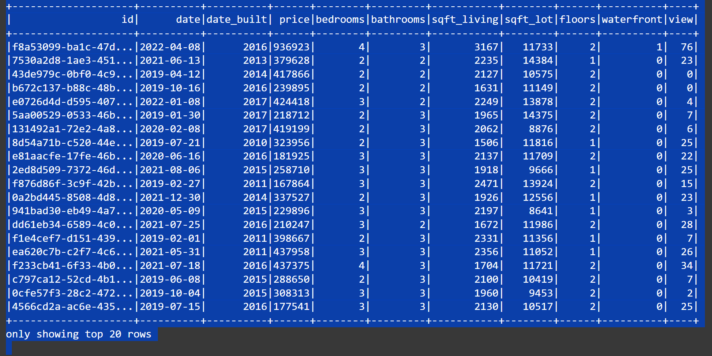
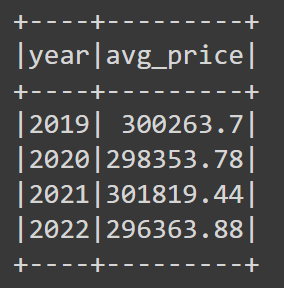
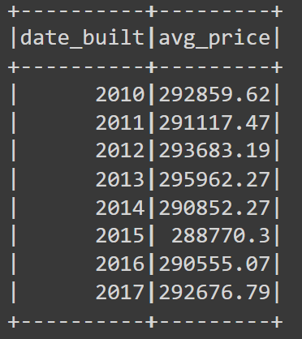
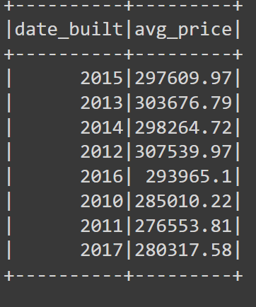
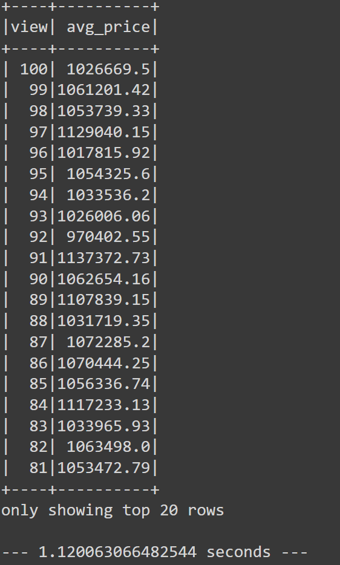

# Home_Sales
Module 22 Challenge

The goal of this challenge was to utilize SparkSQL to determine key metrics about home sales data. The table below is a clipse of home_sales data. 

The following questions were answered:

1. What is the average price for a four-bedroom house sold for each year? Round off your answer to two decimal places.

2. What is the average price of a home for each year the home was built, that has three bedrooms and three bathrooms? Round off your answer to two decimal places.

3. What is the average price of a home for each year the home was built, that has three bedrooms, three bathrooms, two floors, and is greater than or equal to 2,000 square feet? Round off your answer to two decimal places.

4. What is the average price of a home per "view" rating having an average home price greater than or equal to $350,000? Determine the run time for this query, and round off your answer to two decimal places.

I then used Spark to create temporary views, partition the data, cache and uncache a temporary table, and verify that the table has been uncached. The differences in run times were compared. The cached run time was the shortest compared to uncached and parquet data.
